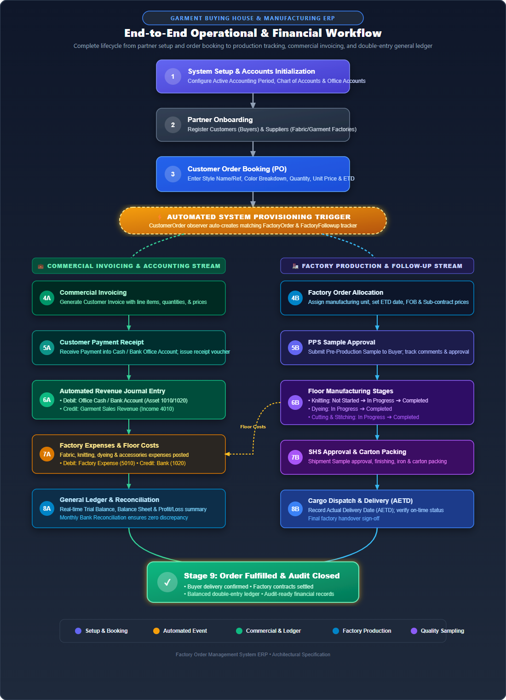
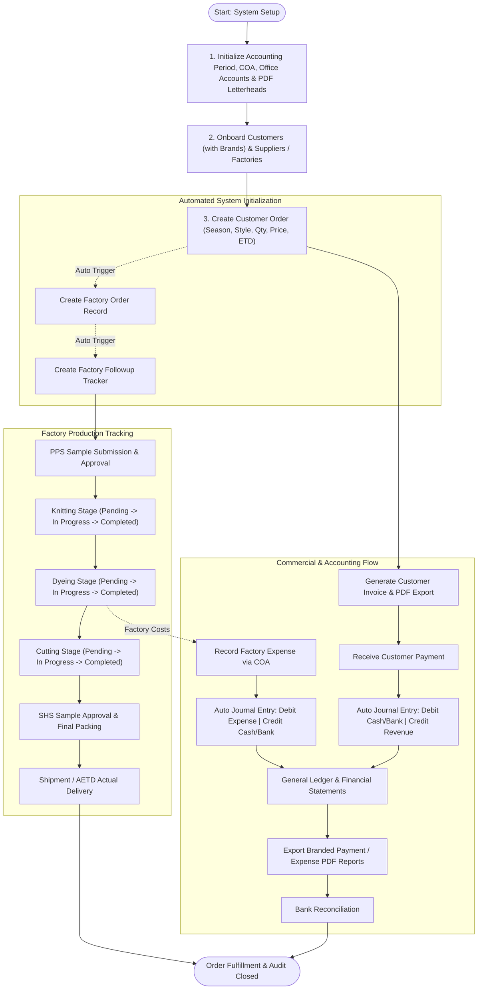

# Factory Order Management — End-to-End System Workflow

Welcome to the **Factory Order Management System** workflow guide. This document details the complete end-to-end operational lifecycle of the system—from partner onboarding and order creation to factory floor tracking, billing, expense management, dynamic PDF letterhead rendering, and double-entry general ledger accounting.

---

## Table of Contents
1. [System Architecture & Core Philosophy](#1-system-architecture--core-philosophy)
2. [End-to-End Workflow Diagram](#2-end-to-end-workflow-diagram)
3. [Stage-by-Stage Lifecycle Walkthrough](#3-stage-by-stage-lifecycle-walkthrough)
   - [Stage 1: System Master Setup & Accounts Initialization](#stage-1-system-master-setup--accounts-initialization)
   - [Stage 2: Partner Onboarding (Buyers & Factories)](#stage-2-partner-onboarding-buyers--factories)
   - [Stage 3: Customer Order Booking & Auto-Initialization](#stage-3-customer-order-booking--auto-initialization)
   - [Stage 4: Factory Production Allocation & Follow-up Tracking](#stage-4-factory-production-allocation--follow-up-tracking)
   - [Stage 5: Commercial Invoicing & Customer Collections](#stage-5-commercial-invoicing--customer-collections)
   - [Stage 6: Factory Expenses & Procurement Management](#stage-6-factory-expenses--procurement-management)
   - [Stage 7: Double-Entry General Ledger & Bank Reconciliation](#stage-7-double-entry-general-ledger--bank-reconciliation)
   - [Stage 8: Payroll & HR Disbursements](#stage-8-payroll--hr-disbursements)
   - [Stage 9: Executive Analytics, Audit & PDF Reports](#stage-9-executive-analytics-audit--pdf-reports)
4. [Dynamic PDF Letterhead & Template Engine](#4-dynamic-pdf-letterhead--template-engine)
5. [Role & Responsibility Matrix](#5-role--responsibility-matrix)
6. [Database Data Flow & Relational Schema](#6-database-data-flow--relational-schema)
7. [Best Practices & Troubleshooting](#7-best-practices--troubleshooting)

---

## 1. System Architecture & Core Philosophy

The Factory Order Management portal is an enterprise ERP designed specifically for garment buying houses, apparel exporters, and manufacturing coordinators.

```
       [ CUSTOMERS / BUYERS ]                      [ FACTORIES / SUPPLIERS ]
                 │ (with Brands)                              │
                 ▼                                            ▼
       ┌──────────────────┐                         ┌──────────────────┐
       │  Customer Order  │ ──── auto-generates ──> │   Factory Order  │
       │  (Sales / PO)    │                         │  (Manufacturing) │
       └────────┬─────────┘                         └────────┬─────────┘
                │                                            │
                ▼                                            ▼
       ┌──────────────────┐                         ┌──────────────────┐
       │ Customer Invoice │                         │ Factory Followup │
       │    & Payments    │                         │ (PPS, SHS, Knit, │
       └────────┬─────────┘                         │  Dye, Cut, Pack) │
                │                                   └────────┬─────────┘
                │                                            │
                ▼                                            ▼
       ┌───────────────────────────────────────────────────────────────┐
       │             Double-Entry General Ledger System                │
       │   (Chart of Accounts, Journal Entries, Bank Reconciliations)   │
       └───────────────────────────────┬───────────────────────────────┘
                                       │
                                       ▼
                       ┌───────────────────────────────┐
                       │  Dynamic PDF Template Engine  │
                       │ (Invoice & Report Letterheads)│
                       └───────────────────────────────┘
```

### Core Principles
1. **Zero Data Disconnect**: Creating a `CustomerOrder` automatically initializes a matching `FactoryOrder` and `FactoryFollowup` tracker. Merchandisers never lose track of a production batch.
2. **Integrated Financial Integrity**: Invoices, customer payments, factory costs, and staff salaries directly feed into the double-entry accounting engine (`ChartOfAccount` + `JournalEntry`), maintaining balanced debits and credits.
3. **Transparent Milestones**: Real-time tracking of sampling (`PPS`, `SHS`) and floor manufacturing (`Knitting`, `Dyeing`, `Cutting`, `Finishing`, `Packing`).
4. **Dynamic Branding & Letterhead Independence**: Invoices and management reports automatically apply custom company letterhead backgrounds uploaded via Settings, without touching template code.

---

## 2. End-to-End Workflow Diagram



<details>
<summary><b>🔍 Click to expand Text / ASCII Flowchart Map</b></summary>

```text
                             ┌────────────────────────┐
                             │  START: SYSTEM SETUP   │
                             └───────────┬────────────┘
                                         │
                                         ▼
                     ┌───────────────────────────────────────┐
                     │ 1. Initialize Accounting Period,      │
                     │    Chart of Accounts, Office Accounts │
                     │    & PDF Letterheads (Invoice/Report) │
                     └───────────────────┬───────────────────┘
                                         │
                                         ▼
                     ┌───────────────────────────────────────┐
                     │ 2. Onboard Business Partners:         │
                     │    Customers (with Brand) & Factories │
                     └───────────────────┬───────────────────┘
                                         │
                                         ▼
                     ┌───────────────────────────────────────┐
                     │ 3. Create Customer Order (PO)         │
                     │    (Season, Style, Qty, Price, ETD)   │
                     └───────────────────┬───────────────────┘
                                         │
                     ┌───────────────────┴───────────────────┐
                     │     AUTOMATIC SYSTEM INITIALIZATION   │
                     │  - Generates Factory Order Record     │
                     │  - Generates Factory Followup Tracker │
                     └───────┬───────────────────────┬───────┘
                             │                       │
     ┌───────────────────────┘                       └───────────────────────┐
     ▼                                                                       ▼
┌─────────────────────────────────┐                     ┌─────────────────────────────────┐
│     COMMERCIAL & FINANCIAL      │                     │        FACTORY PRODUCTION       │
│           LIFECYCLE             │                     │            LIFECYCLE            │
├─────────────────────────────────┤                     ├─────────────────────────────────┤
│ 4. Generate Commercial Invoice  │                     │ 5. Sample Milestones:           │
│    (Dynamic Invoice PDF Export) │                     │    PPS Submission & Approval    │
│               │                 │                     │               │                 │
│               ▼                 │                     │               ▼                 │
│ 6. Receive Customer Payment     │                     │ 7. Floor Production Tracking:   │
│    (Cash / Bank Office Account) │                     │    - Knitting Stage             │
│               │                 │                     │    - Dyeing Stage               │
│               ▼                 │                     │    - Cutting Stage              │
│ 8. Auto Journal Entry Created:  │                     │    - Finishing Stage            │
│    - Debit: Cash / Bank Account │                     │               │                 │
│    - Credit: Sales Revenue      │                     │               ▼                 │
│               │                 │                     │ 9. Final Sample & Packing:      │
│               │                 │                     │    - SHS Sample Approval        │
│               │                 │                     │    - Final Carton Packing       │
│               │                 │                     │               │                 │
│               │                 │                     │               ▼                 │
│               │                 │                     │ 10. Shipment Delivery:          │
│               │                 │                     │     Actual Delivery Date (AETD) │
│               │                 │                     └───────────────┬─────────────────┘
│               │                 │                                     │
│               │ ◄──────── (Factory Floor Expenses & Costs) ───────────┘
│               │
│               ▼
│ 11. General Ledger & Audits:
│     - Balanced Double-Entry Journal
│     - Real-Time Trial Balance & P/L
│               │
│               ▼
│ 12. Reports & PDF Exports:
│     - Payment & Expense Reports with custom letterheads
│     - Bank Reconciliation & Monthly Close
└───────────────┬─────────────────┘
                │
                ▼
┌─────────────────────────────────┐
│ ORDER FULFILLED & AUDIT CLOSED  │
└─────────────────────────────────┘
```

</details>

<details>
<summary><b>📊 Click to view Mermaid Flowchart Code</b></summary>



</details>

---

## 3. Stage-by-Stage Lifecycle Walkthrough

### Stage 1: System Master Setup & Accounts Initialization
Before placing orders, the company's operational and financial framework must be configured:
1. **Active Accounting Period**: Set up the fiscal year (e.g., `FY 2025-2026`). Active periods ensure transactions are chronologically valid.
2. **Chart of Accounts (COA)**: Organizes accounts into standard 5 categories:
   - **Assets (1000s)**: Cash, Bank, Accounts Receivable, Inventory.
   - **Liabilities (2000s)**: Accounts Payable, Accrued Expenses.
   - **Equity (3000s)**: Capital, Retained Earnings.
   - **Revenue (4000s)**: Garment Sales, Export Revenue.
   - **Expenses (5000s)**: Direct Fabric Costs, Trims, Factory Transport, Overhead, Salaries.
3. **Office Accounts**: Physical cash drawers (`Cash in Hand`) and banking accounts (`Primary Bank`, `Export LC Account`) with starting balances.
4. **PDF & Letterhead Branding**: Under **Settings ➔ PDF & Templates**, administrators can upload two distinct letterhead templates:
   - **Invoice Background**: Applied to commercial invoices and proforma billing.
   - **Report Background**: Applied to payment reports, expense registers, and general ledger reports.
5. **Staff & Roles**: Create user profiles for Merchandisers, Production Managers, Accountants, and Administrators.

---

### Stage 2: Partner Onboarding (Buyers & Factories)
1. **Customers (Buyers / Retailers)**:
   - Navigate to: **Customers ➔ Add New Customer**
   - Fields: Company Name, **Brand** (e.g. `Nordic Trend`, `Zara Man`), Contact Person, Email, Phone, Country, Address.
2. **Suppliers (Garment Factories / Fabric Mills)**:
   - Navigate to: **Suppliers ➔ Add New Supplier**
   - Fields: Factory Name, Point of Contact, Phone, Production Facility Address, Specialization (Knitwear, Woven, Denim).

---

### Stage 3: Customer Order Booking & Auto-Initialization
When a buyer issues a Purchase Order (PO) or sales contract:
1. **Create Customer Order**:
   - Navigate to: **Customer Orders ➔ Create Order**
   - Capture order specifications using interactive Select2 dropdowns:
     - `Customer`: Select buyer
     - `Supplier`: Select target manufacturing factory
     - `Order No`: Buyer's PO Number (e.g. `PO-2026-9081`)
     - `Season`: Target collection season (e.g. `Autumn / Winter 2026`)
     - `Style No` & `Style Name`: Product identifier (e.g. `ST-501 Men's Polo`)
     - `Composition`: Material specification (e.g. `100% Combed Cotton 180 GSM`)
     - `Color Name` & `Color Qty`: e.g. `Navy Blue`, `10,000 pcs`
     - `Order Date` & `ETD Date`: Expected Delivery Date
     - `Price`: Unit price per piece (e.g. `$4.50`)
     - `Style Image`: Flat sketch or sample photo upload
2. **Automated Event**:
   - The system immediately triggers the model's `booted()` event:
     - Automatically creates a linked **FactoryOrder** with the agreed pricing and ETD.
     - Automatically creates a linked **FactoryFollowup** stage tracker with initial `Pending` and `Not Started` statuses.

---

### Stage 4: Factory Production Allocation & Follow-up Tracking
Merchandisers and Production Coordinators monitor real-time factory progress:
1. **Factory Order Hub**:
   - Navigate to: **Factory Orders**
   - View assigned orders, ETD price, actual ETD (`aetd_date`), FOB price, and overdue badges.
2. **Factory Follow-Up Milestones**:
   - Navigate to: **Factory Followups ➔ Edit Status**
   - **Pre-Production Sampling (PPS)**:
     - `pps_date`: Date sample was received.
     - `pps_comments_status`: `Pending`, `Submitted`, `Approved`, `Approved with Comments`, `Rejected`, `Revised`.
   - **Production Floor Milestones**:
     - `knitting_status`: `Not Started` ➔ `In Progress` ➔ `Completed` ➔ `Delayed`.
     - `dyeing_status`: `Not Started` ➔ `In Progress` ➔ `Completed` ➔ `Delayed`.
     - `cutting_status`: `Not Started` ➔ `In Progress` ➔ `Completed` ➔ `Delayed`.
   - **Shipment Sampling (SHS)**:
     - `shs_sending_date`: Date final sample was sent to buyer.
     - `shs_comments_status`: `Pending`, `Sent`, `Approved`, `Rejected`.
   - **Pricing Adjustments**: Track `fob_price` and `sub_price` variations.

---

### Stage 5: Commercial Invoicing & Customer Collections
1. **Invoicing & PDF Export**:
   - Navigate to: **Accounts ➔ Invoices ➔ Create Invoice**
   - Select the `Customer Order` with auto-complete, issue date, and payment due date.
   - Enter billing amount and save.
   - Click **Download PDF** or **Print** to produce an official commercial invoice rendered directly atop the dynamic **Invoice Letterhead Background**.
2. **Recording Customer Payments**:
   - Navigate to: **Accounts ➔ Payments ➔ Record Payment**
   - Select `Customer Order` and linked `Invoice`.
   - Specify `Amount` collected, `Payment Type` (Bank Transfer, Cheque, Cash), and destination `Office Account`.
   - System auto-generates a unique receipt number (`REC-YYYYMMDD-XXXX`).
   - Automatically credits accounts receivable and debits the designated bank or cash account.

---

### Stage 6: Factory Expenses & Procurement Management
Manufacturing involves direct materials, trims, lab tests, transport, and sub-contracting fees:
1. **Logging Expenses**:
   - Navigate to: **Accounts ➔ Expenses ➔ Create Expense**
   - Select category from the `Chart of Accounts` (e.g. `5100 - Raw Materials & Fabric`).
   - Choose paying `Office Account` (e.g. `Primary Bank` or `Petty Cash`).
   - Enter amount, description, expense date, and receipt attachments.
2. **Automated Balance Adjustment**:
   - The selected Office Account balance is automatically reduced.
   - An integrated Journal Entry is posted to the General Ledger.

---

### Stage 7: Double-Entry General Ledger & Bank Reconciliation
All business activities flow seamlessly into standard accounting records:
1. **Journal Entries**:
   - View balanced debits and credits:
     - **Customer Payment**: Debit Bank (Asset) / Credit Customer Receivables (Asset).
     - **Factory Expense**: Debit Production Cost (Expense) / Credit Bank (Asset).
2. **Chart of Accounts (COA) Summary**:
   - Real-time balances for all parent and sub-ledger accounts.
3. **Bank Reconciliation**:
   - Navigate to: **Accounts ➔ Bank Reconciliation**
   - Match bank statement entries against system records to identify cleared vs. uncleared deposits/withdrawals.

---

### Stage 8: Payroll & HR Disbursements
1. **Salaries Setup**:
   - Configure staff basic salary, bank account details, and designations.
2. **Monthly Payroll Run**:
   - Generate monthly payroll with allowances and deductions.
   - Disburse payroll from `Office Accounts` (Cash or Bank).
   - System automatically logs an associated `Expense` and `Journal Entry`.

---

### Stage 9: Executive Analytics, Audit & PDF Reports
1. **Executive Dashboard**:
   - **Order Volume & Trends**: Monthly order counts and total dollar volume.
   - **Production Pipeline Status**: Live breakdown of orders in Knitting, Dyeing, Cutting, and Finished stages.
   - **Overdue & Critical ETD Alerts**: Immediate notification of orders approaching delivery deadlines.
   - **Financial Performance**: Profitability per order (Revenue minus Factory Sub-price minus Direct Expenses).
2. **Interactive Financial Reports**:
   - **Payment Report** (`/dashboard/payments/report`): Filter by date range, customer, and payment method with live data cards. Instant **Preview PDF** (in-browser) and **Download PDF**.
   - **Expense Report** (`/dashboard/expenses/report`): Filter by account, category, and date range. Export branded breakdown reports via the PDF generator.

---

## 4. Dynamic PDF Letterhead & Template Engine

The system uses a unified, dynamic letterhead rendering engine that automatically separates billing templates from financial reports:

```php
// Background resolution logic in app/helpers.php:
get_pdf_bg_path('invoice'); // Returns storage/app/public/... or fallback default
get_pdf_bg_path('report');  // Returns storage/app/public/... or fallback default
```

### Template Layout Architecture
- **Invoice Layouts**: Positioned with a top margin to clear the letterhead header, a structured line-item table, and bottom authorization stamp space.
- **Report Layouts**: Full-width executive tables, key performance indicators (KPIs), summary metric cards, and timestamped audit footers.

---

## 5. Role & Responsibility Matrix

| Feature / Module | Super Admin | Admin | Manager | Accountant | Factory Coordinator | Staff |
| :--- | :---: | :---: | :---: | :---: | :---: | :---: |
| **System Settings & PDF Letterheads** | Full | View/Edit | None | None | None | None |
| **Roles & Permissions** | Full | None | None | None | None | None |
| **Customer & Brand Management** | Full | Full | Full | View | View | View |
| **Customer Order Creation** | Full | Full | Full | View | View | View |
| **Factory Followup Tracking** | Full | Full | Full | None | Full | View |
| **Invoicing & PDF Export** | Full | Full | View | Full | None | None |
| **Payments & Expense Logging** | Full | Full | Create | Full | Create | None |
| **Financial Reports (PDF/Preview)** | Full | Full | View | Full | None | None |
| **General Ledger & COA** | Full | Full | None | Full | None | None |
| **Bank Reconciliation** | Full | Full | None | Full | None | None |
| **Payroll Processing** | Full | Full | None | Full | None | None |

---

## 6. Database Data Flow & Relational Schema

```
┌────────────────────────────────────────┐
│               customers                │
│ id, name, brand, email, phone, country │
└──────────────────┬─────────────────────┘
                   │ 1
                   │
                   │ N
┌──────────────────▼─────────────────────┐            ┌────────────────────────────────┐
│            customer_orders             │ 1        1 │           suppliers            │
│ id, customer_id, supplier_id, season,  ├────────────┤ id, name, contact, phone       │
│ order_no, style_no, style_name,        │            └────────────────────────────────┘
│ color_qty, price, order_date,          │
│ etd_date, style_image                  │
└──────────┬──────────────────────┬──────┘
           │ 1                    │ 1
           │ 1                    │ N
┌──────────▼────────┐ ┌───────────▼───────────┐
│   factory_orders  │ │        invoices       │
│ id, aetd_date,    │ │ id, invoice_number,   │
│ etd_price,        │ │ date, total_amount    │
│ sub_price         │ └───────────┬───────────┘
└──────────┬────────┘             │ 1
           │ 1                    │ N
           │ 1              ┌─────▼───────────┐
┌──────────▼────────┐       │    payments     │
│ factory_followups │       │ id, receipt_no, │
│ id, pps_status,   │       │ amount, type    │
│ shs_status,       │       └─────┬───────────┘
│ knitting_status,  │             │
│ dyeing_status,    │             │ N
│ cutting_status    │             │ 1
└───────────────────┘       ┌─────▼───────────┐       ┌────────────────────────┐
                            │ office_accounts │ 1   N │        expenses        │
                            │ id, name, type, ├───────┤ id, amount, date,      │
                            │ balance         │       │ chart_of_account_id    │
                            └─────────────────┘       └────────────────────────┘
```

---

## 7. Best Practices & Troubleshooting

1. **Keep ETD Dates Updated**:
   - When a buyer requests a delivery extension, update both `etd_date` on the Customer Order and `aetd_date` on the Factory Order to prevent false overdue alerts.
2. **Timely Follow-up Entries**:
   - Production floor stages (`Knitting`, `Dyeing`, `Cutting`) should be marked `In Progress` as soon as yarn/fabric hits the machinery, not in bulk at shipment time.
3. **Custom Letterhead Resolution**:
   - Letterheads uploaded in **Settings ➔ PDF & Templates** should ideally be high-resolution JPEG or PNG files formatted to standard A4 (e.g. 2480 × 3508 px at 300 DPI) for optimal PDF clarity.
4. **Balanced Accounting Period Locking**:
   - At the end of each fiscal month or year, ensure all bank accounts are reconciled before locking the `AccountingPeriod` to prevent retroactive unauthorized changes.
5. **Backing Up Database & Uploads**:
   - Regularly backup the MySQL database and uploaded style sketches & letterheads stored in `storage/app/public`.

---
*Factory Order Management System — Engineering & Operations Reference Guide.*
